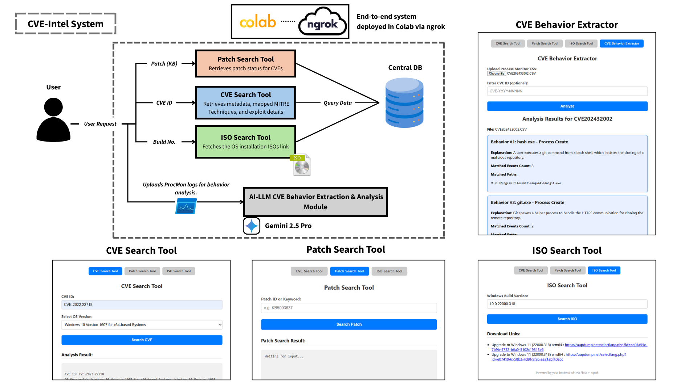
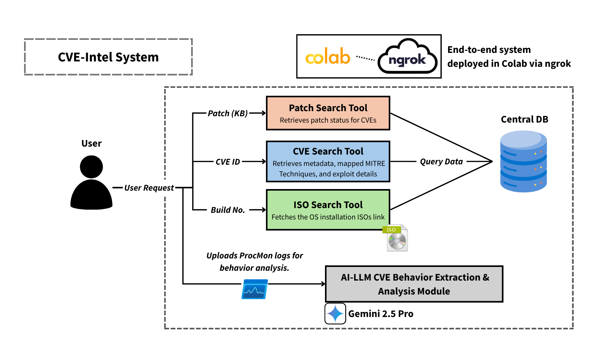

# CVE-Intel
## Purpose

CVE-Intel is a tool designed to provide security analysts with all the essential details needed to reconstruct and thoroughly understand a CVE (Common Vulnerabilities and Exposures). It consolidates critical information to enable deeper insight into each vulnerability, facilitating more effective analysis and response.

Key features include:

- **Detailed CVE Information:** Provides comprehensive descriptions, proof-of-concept (PoC) code, prerequisite environment details such as build numbers, and maps related MITRE ATT&CK techniques to give analysts a full picture of the vulnerability and its exploit context.

- **Patch Coverage Analyzer:** Given a patch (KB) number, the system identifies which CVEs have been addressed by it and highlights those that remain unpatched, helping analysts track remediation coverage and gaps in system security.

- **Quick Environment Setup:** Enables rapid download of required environment components, allowing users to efficiently set up realistic conditions for simulating the CVE exploit.

- **LLM-Based Behavior Extraction:** Uses large language models to analyze input data such as Process Monitor (Procmon) logs, extracting key behaviors related to the CVE to highlight important exploit patterns.

- **Low-Level Contextual Analysis:** Provides in-depth, low-level insights into exploit behavior, helping analysts gain a nuanced understanding of attacker techniques and improve detection strategies.

By combining these features, CVE-Intel empowers analysts to simulate, analyze, and better defend against software vulnerabilities with enhanced precision and context.

**System Overview:**
The diagram below illustrates the overall workflow of the system, including the ngrok web UI.

## Introduction

In today’s rapidly evolving cybersecurity landscape, timely and precise understanding of software vulnerabilities is critical for effective defense. **CVE-Intel** is a tool designed to empower security analysts by consolidating all essential information related to a specific CVE (Common Vulnerabilities and Exposures) in one place. It enables analysts to reconstruct the vulnerability, explore its exploit mechanisms, and simulate attacks in realistic environments.

By combining detailed CVE descriptions, proof-of-concept codes, patch analysis, and MITRE ATT&CK technique mappings, CVE-Intel provides a comprehensive contextual view of each vulnerability. Leveraging large language models for behavior extraction from system logs, it further offers actionable insights into attacker behaviors and exploit techniques at a granular level. The workflow is shown below:

The system consists of several key tools designed to simplify CVE analysis and simulation:

- **CVE Search Tool:** Quickly retrieves detailed CVE info including descriptions, affected software, PoCs, and MITRE ATT&CK mappings.

- **Patch Search Tool:** Identifies which CVEs are fixed or still vulnerable for a given patch (e.g., Windows KB number).

- **ISO Search Tool:** Helps download and manage OS or VM ISO images to set up test environments matching CVE prerequisites.

- **CVE Behavior Extractor:** Uses LLMs to analyze Procmon logs and automatically extract key exploit behaviors related to specific CVEs.

