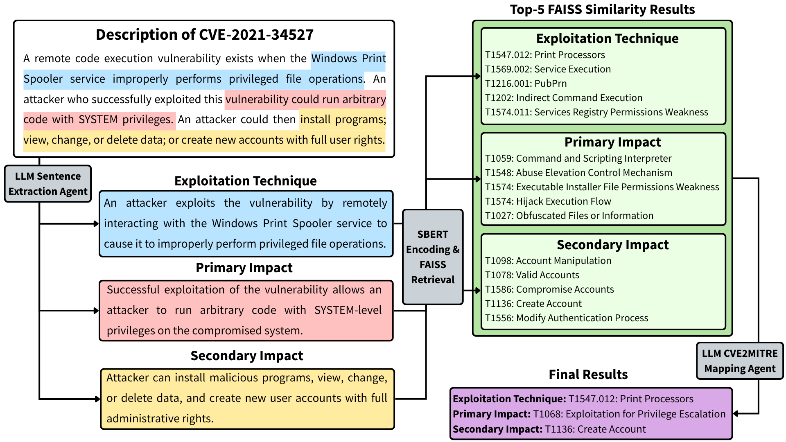

# CVE Threat Intelligence Toolkit
## Purpose

CVE Threat Intelligence Toolkit is a tool designed to provide security analysts with all the essential details needed to reconstruct and thoroughly understand a CVE (Common Vulnerabilities and Exposures). It consolidates critical information to enable deeper insight into each vulnerability, facilitating more effective analysis and response.

Key features include:

- **Detailed CVE Information:** Provides comprehensive descriptions, proof-of-concept (PoC) code, prerequisite environment details such as build numbers, and maps related MITRE ATT&CK techniques to give analysts a full picture of the vulnerability and its exploit context.
- **Patch Coverage Analyzer:** Given a patch (KB) number, the system identifies which CVEs have been addressed by it and highlights those that remain unpatched, helping analysts track remediation coverage and gaps in system security.
- **Quick Environment Setup:** Enables rapid download of required environment components, allowing users to efficiently set up realistic conditions for simulating the CVE exploit.
- **LLM-Based Behavior Extraction:** Uses large language models to analyze input data such as Process Monitor (Procmon) logs, extracting key behaviors related to the CVE to highlight important exploit patterns.
- **Low-Level Contextual Analysis:** Provides in-depth, low-level insights into exploit behavior, helping analysts gain a nuanced understanding of attacker techniques and improve detection strategies.

By combining these features, CVE Threat Intelligence Toolkit empowers analysts to simulate, analyze, and better defend against software vulnerabilities with enhanced precision and context.

**System Overview:**
The diagram below illustrates the overall workflow of the system, including the ngrok web UI.

---

## Introduction

In today’s rapidly evolving cybersecurity landscape, timely and precise understanding of software vulnerabilities is critical for effective defense. **CVE Threat Intelligence Toolkit** is a tool designed to empower security analysts by consolidating all essential information related to a specific CVE (Common Vulnerabilities and Exposures) in one place. It enables analysts to reconstruct the vulnerability, explore its exploit mechanisms, and simulate attacks in realistic environments.

By combining detailed CVE descriptions, proof-of-concept codes, patch analysis, and MITRE ATT&CK technique mappings, it provides a comprehensive contextual view of each vulnerability. Leveraging large language models for behavior extraction from system logs, it further offers actionable insights into attacker behaviors and exploit techniques at a granular level. The workflow is shown below:

The system consists of several key tools designed to simplify CVE analysis and simulation:

- **CVE Search Tool:** Quickly retrieves detailed CVE info including descriptions, affected software, PoCs, and MITRE ATT&CK mappings.
- **Patch Search Tool:** Identifies which CVEs are fixed or still vulnerable for a given patch (e.g., Windows KB number).
- **ISO Search Tool:** Helps download and manage OS or VM ISO images to set up test environments matching CVE prerequisites.
- **CVE Behavior Extractor:** Uses LLMs to analyze Procmon logs and automatically extract key exploit behaviors related to specific CVEs.

---

## Project Design
This section describes the design architecture and processing workflow behind each tool in the system. Each tool is built with a modular and API-driven approach, allowing them to function independently while sharing common components.

### CVE Search Tool Design (Overview)
The **CVE Search Tool** is a core component designed to provide comprehensive information about a CVE, including:

- **Vulnerable OS Versions:**  Lists operating system versions that are vulnerable and can be used to reconstruct the CVE exploit environment.
- **MITRE ATT&CK Mappings:**  Displays related attacker techniques mapped to the CVE using the LLM-assisted mapping methodology.
- **CWE (Common Weakness Enumeration):**  Shows the associated CWE identifiers that describe the type of vulnerability.
- **CVE Description:**  Provides the official vulnerability description sourced from trusted repositories.
- **Proof-of-Concept (PoC) GitHub URLs:**  Links to public repositories containing exploit or demonstration code.
- **Reference URLs:**  Additional external links for deeper research and context.

### CVE-to-MITRE ATT&CK Mapping Methodology

The CVE description is categorized into three technique types:

1. Exploitation Technique - the method (technique) used to exploit the vulnerability.
2. Primary Impact - the initial benefit (impact) gained through exploitation of the vulnerability.
3. Secondary Impact - what the adversary can do by gaining the benefit of the primary impact.

This follows the methodology from the [Center for Threat-Informed Defense's Mappings Explorer](https://center-for-threat-informed-defense.github.io/mappings-explorer/about/methodology/cve-methodology/).

### CVE-to-MITRE ATT&CK Mapping Workflow

When a user inputs a CVE ID, the system retrieves the CVE description and applies a large language model (LLM) to extract meaningful sentences that represent potential attack behaviors. Each extracted sentence is encoded using Sentence-BERT to generate semantic embeddings. In parallel, the MITRE ATT&CK technique descriptions are pre-encoded and stored in a FAISS index. The system then performs similarity search between the sentence embeddings and the ATT&CK embeddings, retrieving the top 10 most relevant techniques for each sentence category. This allows accurate mapping between CVE behavior and MITRE tactics.

1. **User Input:**  The user enters a CVE ID into the system.
2. **Fetch CVE Description:**  The tool retrieves the official CVE description from the CVELIST GitHub repository.
3. **Sentence Extraction with LLM:**  Gemini 2.5 Pro analyzes the description and extracts sentences categorized as Exploitation Technique, Primary Technique, and Secondary Technique.
4. **Text Embedding & Similarity Search:**  Each extracted sentence is transformed into a vector representation using Sentence-BERT. At the same time, the entire MITRE ATT&CK technique database is also encoded into vector embeddings and indexed using FAISS for efficient similarity search. The system then compares the sentence embeddings against the technique embeddings to identify the top 10 most semantically relevant techniques for each category.
5. **CVE Mapping with LLM:**  The candidate techniques are passed to Gemini 2.5 Pro again to reason and select the most suitable MITRE ATT&CK techniques for each category based on the CVE context.
6. **Display Results:**  The final mapped technique are presented to the user.

### CVE-to-MITRE ATT&CK Mapping Use Case

---

